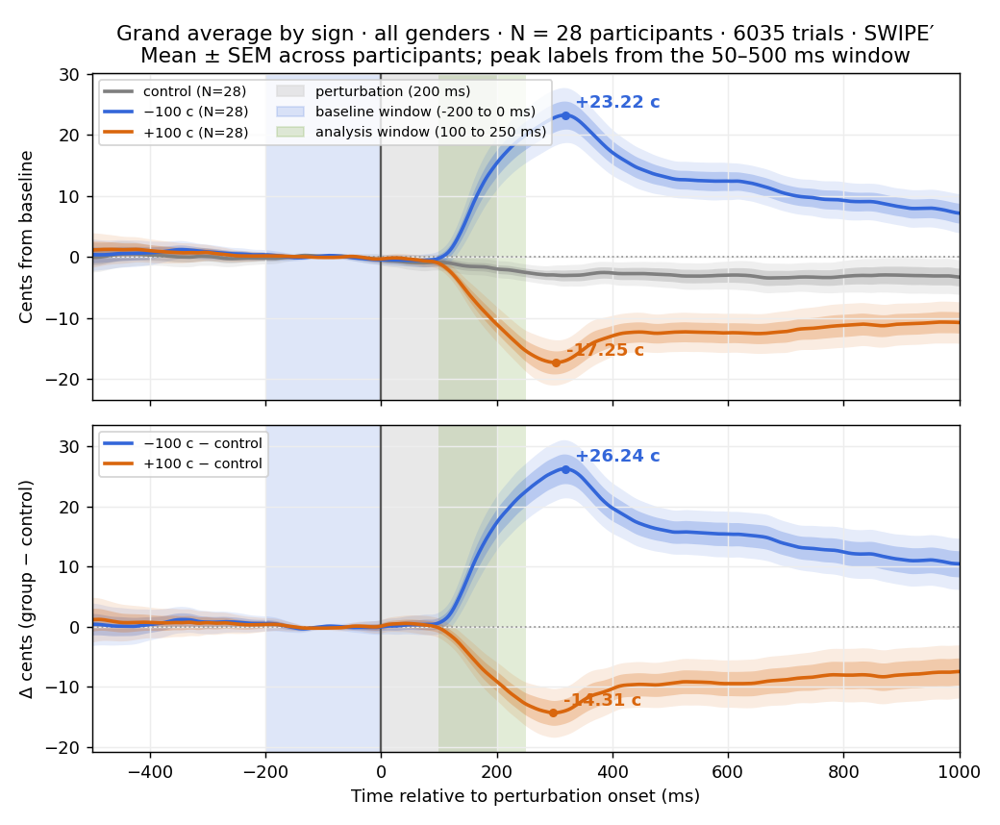

# Pitch Explorer: An Interactive Tool for Exploring Pitch-Compensation Data

Technical report · Albina Serdiuk · August 2026

---

## Abstract

Pitch Explorer is a self-contained, browser-based tool for interactively exploring reflexive pitch-compensation data. It reads a portable dataset of CSV tables plus one JSON configuration file, embeds the whole corpus directly in a single HTML file, and lets a researcher aggregate the data live (by shift direction, gender, participant, and individual trial) in the browser, from that one file. Two views are provided: an *Explore* view for building and comparing custom averages, and a *Group Average* view that reproduces the study's grand-average figure. Both share user-defined baseline and analysis windows, typed directly as numbers and shaded on every chart, and both report a paired t-test between those two windows with an effect size and a confidence interval. The tool recomputes a perturbation-locked mean ± SEM on every interaction. This report describes the input contract, the build pipeline, the aggregation engine, the statistics, the user interface, and the validation: the grand average is computed independently in JavaScript and Python, the statistics are verified against scipy and a frozen MATLAB fixture, and re-deriving the grand average from the original recordings agrees with the stored, quantized values to within 0.01 cents. The included corpus is the bachelor-thesis recording set: 28 participants, 6,035 trials of a sustained vowel /a/ under a ±100-cent, 200 ms pitch perturbation. The tool is implemented in plain JavaScript, embedding one statistics library (jStat) for the *t*-distribution, and its data format is general, so the same tool can serve other perturbation experiments.

---

## 1. Introduction

When a speaker hears their own voice shifted in pitch, they reflexively adjust their production in the opposite direction: a compensatory response measured in cents relative to a pre-shift baseline. Studying this response means looking at many short pitch-over-time curves: one per trial, per participant, per shift direction, averaged in various ways. Doing that exploration inside MATLAB requires the toolchain, the raw data, and edits to plotting scripts for each new question.

Pitch Explorer moves that exploration into a single web page. The design goals were:

1. Local, offline distribution. One HTML file that a researcher opens locally by double-click and runs offline.
2. Faithful aggregation. The tool's grand average must match the source analysis pipeline when all data is selected, so its numbers can be trusted.
3. Live interactivity. Selecting or deselecting a shift, a gender, a participant, or a single trial must recompute the displayed average immediately.
4. Windows the user chooses. The measurement windows are user inputs, so a reader can test whether a result depends on where the window was placed.
5. A documented, tool-independent input format. The tool consumes plain tables, so preparing a dataset needs only those tables and the format specification.

This report documents how those goals were met and how the result was validated.

---

## 2. Data source and sample

The corpus is a single study: participants recording a sustained vowel /a/ across several sessions. On a subset of trials a pitch perturbation of ±100 cents was applied for 200 ms after a randomized baseline period. The remaining trials are unperturbed controls.

The recordings cover 31 participants. Three participants who were not naive to the purpose of the experiment are excluded, on the supervisor's agreement, so the tool includes 28 participants (16 female, 12 male) and 6,035 trials: 1,816 control, 2,086 at −100 cents, and 2,133 at +100 cents. By gender that is 3,420 female and 2,615 male trials. The exclusion is applied once, in the format converter, and the published dataset carries no record of which participants were removed. It rests on naivety to the experiment's purpose, decided independently of anything the excluded recordings show.

Each trial is stored as a perturbation-locked epoch of the produced-voice pitch, expressed in cents relative to that trial's baseline, on a fixed time grid of 751 samples spanning −500 ms to +1000 ms around perturbation onset at a 2 ms hop. Fundamental frequency was estimated with SWIPE′ (Camacho & Harris, 2008) and converted to baseline-relative cents by the MATLAB pipeline (`build_epoch_cache.m` → `extract_trial_cents.m`). The baseline used for that conversion is the mean over the −200 ms to 0 ms window. Pitch Explorer consumes these cent epochs as its input. About 0.65% of stored samples are gaps, from artifact removal in the MATLAB pipeline.

Recording ran with the audio interface at 48 kHz and Audapter processing at 24 kHz. Both figures are read from the recordings (`params.sRate` and `downFact`) and are recorded in the dataset configuration.

Convention: because compensation is the voice moving *opposite* the imposed shift, a −100 cent (downward) shift drives the produced pitch up, and a +100 cent (upward) shift drives it down (Burnett et al., 1998).

> Sample size: an early pilot covered 18 participants. The recordings now cover 31 participants, of whom 28 are included, so the tool and every figure in this report reflect N&nbsp;=&nbsp;28.

---

## 3. System architecture

The system has four layers, each in its own artifact:

```
  MATLAB epoch files (.mat, per participant)        [existing MATLAB pipeline]
            │
            ▼
  convert_mat_to_csv.py  ── format converter, run once
     · re-expresses the same numbers as CSV tables + one JSON config
     · applies the participant exclusions
            │
            ▼
  csv_dataset/  ── the portable input format (the documented contract)
     · dataset.json, trials.csv, curves/<participant>.csv
            │
            ▼
  export_pitch_explorer.py  ── build pipeline
     · validates the input contract, quantizes, packs a manifest + binary blob
     · inlines app.css, app.js, engine.js and jStat, injects a gzip+base64 payload
            │
            ▼
  app_template.html + app.css + app.js + engine.js  ── the application
     · engine.js: decode layer (gunzip + typed-array views),
       aggregation (participant means, mean ± SEM),
       statistics (paired window test, effect size, CI; t-distribution from jStat)
     · app.js: chart renderer (custom canvas), two views, export
     · template: page markup and the placeholders the build fills
            │
            ▼
  pitch_explorer.html  ── the built, self-contained deliverable (≈2.2 MB)
```

The split at `csv_dataset/` separates the MATLAB-specific stages, which run once, from the portable ones, which work from plain tables. A researcher with data from another study joins the chain at that point.

The front end is plain HTML, CSS, and JavaScript. Its source is split across the template (page markup and build placeholders), `app.css` (styles), `app.js` (views, chart renderer, and boot), and `engine.js` (computation), and the build inlines all four into the deliverable, together with one embedded third-party library: jStat (MIT license, `vendor/jstat.min.js`), which supplies the *t*-distribution. The built tool is therefore one self-contained HTML file that a researcher opens directly and runs offline.

### Two-stage extraction and the epoch cache

The pitch contours are produced in two stages, separated by an on-disk cache. The first stage (`build_epoch_cache.m`, calling `extract_trial_cents.m`) reads each participant's raw recordings, estimates F0 with SWIPE′, converts it to baseline-relative cents, and writes one compact file per participant containing only the resulting epoch vectors and per-trial metadata. The second stage (`convert_mat_to_csv.py`, then `export_pitch_explorer.py`) reads those cached epochs and reformats them into the portable dataset. F0 estimation therefore runs once, in the first stage, and the later stages reuse its result.

The results are unaffected by the cache. The cache stores the extractor's output, a memoization of a deterministic computation. Reading an epoch from the cache and recomputing it from the raw audio produce identical values. A cache is rebuilt automatically whenever its source files or extraction parameters change, so it stays in step with the recordings.

The cost saving is large. SWIPE′ is the most expensive operation in the pipeline: the extractor invokes it three times per trial, about twenty thousand invocations across the full corpus and tens of minutes of computation. Recomputing the contours from the raw recordings on every regeneration of the dataset, every change to the export, and every re-plot would repeat this cost and re-read the full-length audio waveforms, which are much larger than the extracted contours. With the cache in place, the conversion and export stages complete in seconds, adding a participant re-extracts only that participant, and the builder processes one recording at a time, so peak memory stays bounded by a single file.

Confining the expensive, MATLAB- and audio-specific processing to the first stage keeps the converter and exporter small: they run from the cached epochs alone. The dataset and the tool can therefore be rebuilt on any machine.

---

## 4. The input format

### 4.1 Why CSV rather than MATLAB files

The MATLAB pipeline stores its epochs as `.mat` files. Requiring that as the tool's input would tie the tool to a proprietary format: a researcher without a MATLAB license could not prepare data for it, and the structure of the input would be whatever the MATLAB struct happened to contain. The converter therefore re-expresses the same numbers as tables. The format is fully specified in `DATA_FORMAT.md`, with a runnable example in `csv_dataset_example/`.

### 4.2 The three parts

- `curves/<participant>.csv` — the measured data. One row per trial, one column per time sample, each cell the pitch at that moment in cents relative to that trial's baseline. The header row carries the time of each sample in ms relative to onset. An empty cell means no reliable measurement there, and must stay empty: writing `0` would assert that the voice was at baseline, which is a different claim, and would pull every average toward zero.
- `trials.csv` — one row per trial, carrying what the trial *was*: participant, trial index, gender, condition, whether feedback was shifted, the signed shift in cents, the perturbation duration measured on that trial, and the baseline F0 in Hz.
- `dataset.json` — the configuration needed to read the tables: the epoch geometry, the units, the perturbation timing, the list of conditions, the participant list, and the totals.

`conditions` is a list of any length with exactly one control, so a study with three shift magnitudes, or only one direction, describes itself the same way. The tool reads its conditions from the file, so it works for any shift magnitudes. `epoch` carries the time grid, so the same code handles a study with a different baseline length.

### 4.3 Validation of the input

Because the format is meant to be prepared by someone who did not write the tool, the build stops with a plain message on the first violation. It checks that:

- exactly one condition is marked as the control
- every condition named in `trials.csv` is declared
- each curves file has the declared number of time columns and the declared time values
- each participant's row count matches its `nTrials`
- every curve row has a corresponding metadata row
- every named file exists

Each check names the file, the line or column, and what was expected.

### 4.4 The embedded payload

Embedding the CSV form directly would be too large: roughly 4.5 million numbers, stored as text, would be about 28 MB, and the browser would have to parse all of it on every load. At build time the curves are therefore rounded to the nearest whole cent and stored as little-endian int16, with −32768 reserved as a gap sentinel, concatenated trial by trial, gzipped, and base64-encoded into the HTML. Trial-major ordering makes the blob compress well, because consecutive samples of one smooth curve are highly correlated. At load the page decompresses it with the browser's native Compression Streams API and builds typed-array views directly over the decoded buffer, entirely in memory.

The result is a data payload of about 9 MB raw, compressing to a built HTML file of about 2.2 MB. What the rounding costs is quantified in Section 9.

### 4.5 One representation of the data

The payload holds only per-trial curves, at the dataset's full 2 ms resolution. Per-participant means and grand averages are computed in the browser from those curves.

An earlier build also embedded pre-computed per-participant mean curves, on the reasoning that the Group Average view needs them at full resolution. Averaging a few hundred short curves is cheap, so the saving was small. A second copy also carried a cost. It could fall out of step with the trial curves, and a grand average read from stored means could not respond to the user excluding a participant or a trial. Computing every average from the trial curves keeps a single source of truth and lets participant and trial exclusion reach the Group Average view.

---

## 5. Aggregation engine

### 5.1 Selection state

An Explore panel's state is a selection: the current shift condition, the set of included participants, and a set of excluded individual trials. The Group Average view carries its own participant selection. The participant checkboxes are the single source of truth for who is in the aggregate. The All / Female / Male buttons set those checkboxes directly, so the buttons and the list always agree. The engine turns a selection into the set of matching trials and reduces them to a mean curve.

### 5.2 Units of averaging

- Explore view — trial-level display. The displayed mean ± SEM is computed across the selected trials, the appropriate unit when the user is toggling individual trials in and out.
- Group Average view — participant-level. Each participant is first reduced to one mean curve per condition. The grand mean and SEM are then taken across participants, so N is the number of participants and a participant with more trials does not dominate.

In both cases mean and SEM are gap-aware: a sample is averaged over whatever trials or participants have a finite value there. Per-participant means are cached per participant and condition, and the cache is bypassed whenever a trial-level exclusion is active, so a cached value can never outlive the selection that produced it.

### 5.3 Smoothing

Mean and SEM curves are smoothed with a Gaussian-weighted moving average, ported to be numerically identical to MATLAB's `smoothdata(x,'gaussian',window,'omitnan')`: a Gaussian kernel with standard deviation window/5, gap-aware renormalization, and a window that shrinks at the epoch edges. The smoothing is defined in *time* (30 ms, a 15-sample window at 2 ms), and the window is recomputed from the stored time step, so a coarser build gets the same physical smoothing. This identical definition is what lets the JavaScript engine match the Python reference (Section 9).

Smoothing applies to what is displayed. The window statistics are computed on the unsmoothed participant curves, so the reported numbers do not depend on a display choice.

### 5.4 The difference tile

The Group Average view's second tile shows each perturbed condition minus control. The difference is taken at the grand-mean level, and its SEM is the quadrature sum of the two conditions' SEMs.

---

## 6. Statistics

### 6.1 The two windows

Both views carry two windows, each entered as a number:

- a baseline window, by default −200 to 0 ms
- an analysis window, by default 100 to 250 ms, the window used by Miller et al. (2023).

Both are shaded on every chart and update live. Values are clamped to the epoch, and when a bound crosses the other the box being edited keeps what was typed while the other bound gives way, so a typed value is never replaced without the user's action. One-click presets fill the analysis boxes with the Miller 100 to 250 ms window and the 50 to 500 ms window used for time-to-peak by Franken et al. (2018). The perturbation onset is drawn as a labeled line, since both windows are read against it.

### 6.2 The paired window test

Each analysis unit contributes one difference: its mean over the analysis window minus its mean over the baseline window. A paired *t*-test asks whether those differences differ from zero. It is called paired because both numbers come from the same unit.

A window spans many samples (the default baseline window covers 51 of them), so each window must be summarized by a single number. The mean is the summary used, and it is the convention for compensation amplitude in this literature. The peak is reported separately but is unsuitable for the test itself: taking the largest value in a window lets noise inflate it systematically.

Reported: the mean difference in cents, *t*, df, a two-sided *p*, Cohen's *d_z* (the mean of the differences divided by their standard deviation), a 95% confidence interval, and the peak inside the analysis window. Each *p*-value is reported with its effect size and interval.

The *t*-distribution is computed in the page by jStat, an established statistics library embedded at build time: the two-sided *p* value is derived from `studentt.cdf` and the critical value for the confidence interval from `studentt.inv`. The Python build uses scipy for the same distribution.

### 6.3 The unit of analysis

The unit is the participant by default: each participant's trials are averaged first, and the test then runs across participants. A trial-level option is offered and labeled as such. Trials are nested within participants, so a trial-level test treats non-independent observations as independent and its degrees of freedom are inflated. On the included sample the same comparison gives *t*(27) at the participant level and *t*(2081) at the trial level. The tool states this in the interface, and the participant-level result should be reported.

### 6.4 Direction and control correction

The Group Average view adds two options:

- Direction. *Signed-combined* pools every shifted condition after inverting the up-shift responses, so compensation counts as positive whichever way the feedback moved, following the sign-normalization convention (Miller et al., 2023). Alternatively a single shift direction can be taken on its own, in which case the sign follows the condition.
- Correct for control. Subtracts each participant's own control curve before the statistics, isolating the response from baseline drift.

The two settings interact. Each pooled condition contributes `(curve − control) × flip`, so the control term carries a factor equal to the sum of the flips. With an equal and opposite pair pooled under sign-normalization that sum is zero, and the correction cancels exactly: on the included sample the signed-combined result is +9.42 cents whether or not the checkbox is selected. This follows from the pooling and is arithmetically correct, but a checkbox that appears inert is misleading, so the tool explains it and points the reader to a single direction, where the correction does change the result (+10.56 to +12.22 cents downward).

### 6.5 Multiplicity

Because the windows are free, a user can try many of them. The tool reports each result as it is asked for and applies no correction. Nothing in the interface should be read as a confirmatory test. A window chosen after seeing the result is an exploratory choice and should be reported as one.

---

## 7. User interface and views

### 7.1 Explore view

The Explore view offers a single-panel mode and a two-panel compare mode. Each panel carries its own controls:

- Shift selector — one shift direction per panel.
- Participant shortcuts — All / Female / Male buttons that select that group in the sidebar. The highlight follows the current selection and clears when a chosen subset matches none of the three, so the buttons never show a stale state.
- Participant sidebar — every participant with gender and trial count and an include checkbox, plus a master select-all checkbox with an "n of N selected" counter.
- Per-trial thumbnails — expanding a participant renders a small sparkline for each of its trials in the selected condition. Clicking a thumbnail includes or excludes that single trial, and the average recomputes from the remaining trials.
- Windows, unit selector, and statistics panel — as in Section 6.
- Export — PNG of the figure and CSV of the displayed data.

Compare mode places two such panels side by side so any two subsets can be compared directly, for example −100 c versus +100 c, or female versus male.

### 7.2 Group Average view

The Group Average view draws the control, downward, and upward shifts together, averaged across participants. It uses the same participant shortcuts and sidebar as the Explore view, the shared windows, the direction and control-correction options, and the statistics panel. The top tile shows each condition against its own baseline (mean ± SEM), and the Direction control sets what it shows: Both directions, the default, draws all conditions together; Signed-combined draws the single pooled compensation curve with its peak marked, matching the panel; and a single direction emphasizes that shift. The bottom tile shows each perturbed condition minus control. This view is validated against the source pipeline (Section 9).

### 7.3 Interactive exclusion

Participant and trial exclusion is interactive in both views. The built tool opens with the whole sample selected (all 28 participants, all trials). Excluding anyone further is an action the user takes in the interface, and the average recomputes from what remains. The default presentation is therefore always the complete sample.

---

## 8. Chart rendering and export

Charts are drawn by a custom canvas renderer. The renderer provides:

- a device-pixel-ratio-aware canvas
- automatic axis ranges and gridlines
- axis titles with units (cents on y, milliseconds on x)
- any number of shaded regions, used here for the perturbation window and the two analysis windows, each with its own edge marking
- a solid labeled onset line
- two nested uncertainty bands (±1 SEM and ±1.96 SEM) as gap-aware filled polygons
- the mean lines, a zero line, and peak annotation dots with their cents labels

A legend identifies every line and every shaded region, so a reader can interpret each figure from its axes, legend, and caption alone.

Figure export uses the canvas's own `toBlob` to produce a PNG. Data export writes a CSV of the currently displayed series (time in ms and, per series, mean and SEM in cents). Both trigger a normal browser download of a locally generated file.

---

## 9. Validation

### 9.1 Method: one engine, checked against independent references

The numbers in the browser are computed by one JavaScript engine, `engine.js`. The build inlines this file into `pitch_explorer.html`, and the Node test (`tests/test_engine.js`) loads the same file directly, so the code under test is the code that runs in the page. Validation rests on comparisons with sources that share none of the engine's code:

1. A second implementation of the aggregation (`export_pitch_explorer.py`). The study-specific steps (sign-normalized pooling, control subtraction, window means, participant-level averaging) are implemented twice, once in the engine and once in Python. The Python side writes `pitch_explorer_reference.json`. `tests/test_engine.js` recomputes every reference value with the engine from the embedded payload, and `tests/test_export.py` decodes the payload separately in Python and re-derives the same values, testing quantization and packing end to end.
2. A statistics library for the *t*-distribution. The engine reads *p* values and confidence-interval critical values from jStat, and the Python build reads them from scipy. In both languages the distribution comes from a maintained library.
3. scipy on the engine's own difference vectors (`tests/test_scipy_check.py`). The Node test writes the engine's per-participant paired differences to a file; the scipy check recomputes each test from those vectors with `scipy.stats.ttest_1samp` and confirms the engine's *t*, *p*, *d_z*, and confidence interval, and that the same vectors reproduce the reference values.
4. MATLAB as the authority on the smoothing. `tests/fixtures/gauss_fixture.csv` holds `smoothdata(x, 'gaussian', 15, 'omitnan')` output for a fixed input with gaps, generated once in MATLAB at full double precision. The JavaScript and Python smoothing ports are both checked against it and agree with a largest difference below 10⁻¹³.

`tests/test_roundtrip.py` follows the numbers through every stage (MATLAB epoch files, CSV dataset, embedded payload) and re-derives the grand average at full precision from the original files for comparison with the stored, quantized values. The browser itself is exercised by the interface suite, `tests/test_ui.html`, which drives the built file in a frame and compares the displayed numbers against the reference (Section 9.5).

### 9.2 Results

On the N&nbsp;=&nbsp;28 sample, the by-sign grand-average peaks (50 to 500 ms window) are:

| Group | N | −100 c peak | +100 c peak |
|---|---:|---:|---:|
| all genders | 28 | +23.22 c | −17.25 c |
| female | 16 | +27.02 c | −18.05 c |
| male | 12 | +19.19 c | −17.90 c |

and the perturbed-minus-control peaks for all genders are +26.24 c (−100 c) and −14.31 c (+100 c). The signs are as expected: the downward shift drives the voice up, the upward shift drives it down, and the control condition changes little.

The paired window test at the default windows (baseline −200 to 0 ms, analysis 100 to 250 ms), with the participant as the unit, across all 28 participants:

| Direction | Control-corrected | Mean difference | *t*(27) | *p* | *d_z* | 95% CI |
|---|---|---:|---:|---:|---:|---|
| signed-combined | either | +9.42 c | 7.62 | < .001 | 1.44 | [6.88, 11.95] |
| −100 c only | yes | +12.22 c | 9.04 | < .001 | 1.71 | [9.45, 14.99] |
| −100 c only | no | +10.56 c | 6.20 | < .001 | 1.17 | [7.06, 14.06] |
| +100 c only | yes | −6.61 c | −4.75 | < .001 | −0.90 | [−9.47, −3.75] |
| +100 c only | no | −8.27 c | −7.60 | < .001 | −1.44 | [−10.50, −6.04] |

The signed-combined row is listed once for both correction settings because the control terms cancel exactly under sign-normalization (Section 6.4).

All checks agree. The engine and the Python re-derivation reproduce every value above from the embedded payload, scipy reproduces the engine's statistics from the engine's own difference vectors, and the browser reports the same figures. Re-deriving the grand average at full precision from the original recordings agrees with the stored values to within 0.01 cents, well below the two-decimal display precision.

Figure 1 is the validation figure, rendered from the CSV dataset with the tool's algorithm.



Figure 1. By-sign grand average, all genders (N&nbsp;=&nbsp;28 participants, 6,035 trials), mean ± SEM across participants. Top: each condition against its own baseline. Bottom: each perturbed condition minus control. Gray&nbsp;=&nbsp;the 200 ms perturbation window, blue&nbsp;=&nbsp;the default baseline window (−200 to 0 ms), green&nbsp;=&nbsp;the default analysis window (100 to 250 ms). Bands are ±1 and ±1.96 SEM. Peak labels, in cents, are taken from the 50 to 500 ms window. Rendered from the same CSV dataset the tool is built from, so the figure and the tool stay in step.

### 9.3 Rounding budgets

Two rounding stages are declared and tested separately:

| Stage | Effect on one sample |
|---|---|
| CSV, two decimals | ≤ 0.005 cents |
| Payload, whole cents | ≤ 0.5 cents from the CSV value |
| Both, measured against the original `.mat` | ≤ 0.505 cents |

The third row is not 0.5: the payload quantizes the already-rounded CSV value, so the two stages add. The observed worst case across the spot-checked participants is 0.5026 cents. After averaging within a participant and then across participants the error falls to the 0.01 cents quoted above.

### 9.4 Unit tests

The Node test also checks engine primitives directly. The Gaussian smoother returns a constant unchanged, preserves length while filling across gaps, and matches the frozen MATLAB `smoothdata` fixture with a largest difference below 10⁻¹³. The one-sample *t* routine returns *t*&nbsp;=&nbsp;4.2426, df&nbsp;=&nbsp;4, *p*&nbsp;=&nbsp;.013 for the sample [1, 2, 3, 4, 5], matching the analytic value. The two-sided critical value at df&nbsp;=&nbsp;27 is 2.0518. A fixture with known differences [2, 4, 6, 8] returns a mean difference of 5, *t*&nbsp;=&nbsp;3.8730, and *d_z*&nbsp;=&nbsp;1.9365. That fixture also confirms that both window bounds are inclusive, so a step change placed at *t*&nbsp;=&nbsp;0 falls inside the baseline window.

Two structural facts are pinned as tests: that control correction cancels exactly under signed pooling but changes a single direction, and that the built file contains no trace of any excluded participant.

### 9.5 Interaction and edge-case testing

The following were confirmed in the browser:

- single and compare modes, and the shift, gender, participant, and per-trial toggles each recompute the average
- typed window values move the shaded bands and the statistics, and restore the original numbers when set back
- values beyond the epoch are clamped to it, and the box just edited keeps what was typed
- presets fill the analysis boxes
- switching between participant- and trial-level units changes the reported df as expected
- the direction and control-correction options change the numbers in the expected direction
- excluding a participant moves the Group Average as well as the Explore panels, taking the title, the trial count, and the statistics with it
- PNG and CSV export produce valid output

Edge cases are handled: an empty selection yields an all-gap average and dashed statistics with no error, and a single participant renders normally.

The interaction checks above are automated in `tests/test_ui.html`, which is served over HTTP and drives the built tool in a frame. All five command-line suites pass as well:

```bash
python tests/test_export.py
```
```bash
node tests/test_engine.js
```
```bash
python tests/test_scipy_check.py
```
```bash
python tests/test_roundtrip.py
```
```bash
python tests/test_validation.py
```

---

## 10. Outcomes and design revisions

What worked well.

- Embedding the whole corpus in one file. Gzip + int16 quantization turns roughly 28 MB of CSV into a 2.2 MB self-contained page that opens by double-click and runs offline. This worked because the curves are smooth and trial-major ordering makes consecutive samples highly correlated, so they compress well. The whole-cent rounding that made it possible costs at most ~0.5 cents per sample, and far less after averaging (Section 9.3).
- A tool-independent input format. Splitting the pipeline at `csv_dataset/` worked: everything MATLAB-specific runs once, and the tool itself reads plain tables that a researcher can prepare on any machine. The format validator turns a malformed dataset into a message that names the file and the problem.
- Cross-checking the numbers against independent references. Requiring the engine and a separate Python implementation to agree on the same payload, verifying the engine's statistics against scipy and its smoothing against MATLAB, and matching a full-precision re-derivation from the original `.mat` files to within 0.01 cents, caught drift during development and lets the reported figures be trusted.

What did not work, or had to change.

- The two-copy design failed and was removed. An earlier build also embedded pre-computed per-participant mean curves, so the Group Average would not have to re-average on every load. The two copies could fall out of step, and a grand average read from stored means could not respond to the user excluding a participant or trial, so the exclusion feature did nothing on that view. Averaging a few hundred short curves is cheap, so the second copy saved almost nothing. It was removed, and every average is now derived from the trial curves.
- The control-correction checkbox looked broken. Under signed-combined pooling of equal-and- opposite shifts, the control terms cancel exactly, so ticking "Correct for control" changes nothing (+9.42 cents either way). This is arithmetically correct, but an inert-looking control is misleading, so the tool explains the cancellation in a note and points the reader to a single direction, where the correction does change the result.
- `file://` decoding is browser-dependent. Decoding the embedded payload uses the Compression Streams API, which some browsers refuse to run from a `file://` page. There is no in-page workaround, so this is documented instead: the README and Section 11 tell the user to serve the folder with `python -m http.server` if a direct double-click fails.
- Quantization is a bounded trade-off. Whole-cent rounding is what makes the payload small, but it means the built file is not a lossless archive, and the CSV dataset remains the fuller record. The cost is bounded and measured (Section 9.3).

---

## 11. Reproducibility, deployment and usage

Open the tool: double-click `pitch_explorer.html`. It uses the browser's Compression Streams API (current Chrome/Edge, Firefox 113+, Safari 16.4+). If a browser refuses to decode a local file, serve the folder with `python -m http.server` and open it over `http://127.0.0.1`.

Deployment. The deliverable is a single static file, so it can be opened directly, sent as an attachment, or dropped on any static host as-is. It is hosted on GitHub Pages at https://cavacubo.github.io/pitch-explorer-app/.

Rebuild the data after the recordings change:

```bash
python convert_mat_to_csv.py --example
```
```bash
python export_pitch_explorer.py
```

The first step needs `scipy` and the MATLAB epoch files. The second runs from the CSV dataset alone. The full `csv_dataset/` is about 28 MB. It is reproducible from the epoch files at any time, and a five-trial sample is provided as `csv_dataset_example/`.

Regenerate the report figure: `python generate_report_figures.py`.

The pipeline is deterministic: the same recordings always produce the same dataset, the same payload and the same figures. Every number in this report and in `README.md` is taken from `pitch_explorer_reference.json`, which the build regenerates.

---

## 12. Design for generalization

The tool includes one corpus but is written to generalize beyond it. Several elements are already general. The input format declares its own conditions, epoch geometry, and units, so the tool reads the design from the data. That format is validated with messages aimed at whoever prepares a dataset, and a runnable example is provided. Rendering is manifest-driven, with no hard-coded knowledge of "±100 c" or "female/male". The study's own data serves as the built-in demonstration.

What remains for a general tool is described in `ROADMAP.md`: a loader for user-supplied datasets chosen in the browser, validation against a second real dataset, broadening beyond pitch to formant and time-warp paradigms, and a form that generates experiment configuration files. `ROADMAP.md` also records what is intentionally out of scope for a browser tool: hardware and audio-interface checks, native packaging, and a full experiment runner, each of which needs a native application.

---

## 13. Limitations

- Measurement is produced-voice pitch (`signalIn`) in baseline-relative cents. The tool inherits the F0 estimation and artifact handling done in the MATLAB pipeline and works from the resulting cent epochs.
- Trial-level statistics treat trials as independent. They are offered as a labeled secondary option, and their degrees of freedom are inflated. The participant-level test should be reported.
- Free windows invite multiplicity. The tool applies no correction and cannot know how many windows a user tried. A window chosen after seeing the result is exploratory.
- Generality rests on the design and on validation of the format, and has not yet been tested against a second dataset. The input contract is documented, illustrated with an example, and checked, but it has been exercised on one corpus.
- The tool reads a dataset embedded at build time. Displaying a new dataset means re-running the build rather than opening a file in the page.
- Whole-cent quantization is applied to the embedded curves. Its cost is bounded and measured (Section 9.3), but the payload is not a lossless archive. The CSV dataset is the fuller record.

---

## 14. Conclusion

Pitch Explorer is a single, self-contained HTML file that lets a researcher explore the pitch-compensation corpus interactively, by shift, gender, participant, and individual trial. The user chooses the baseline and analysis windows directly and reads a paired comparison between them, with an effect size, a confidence interval, and one-click PNG and CSV export. Its input is a documented, validated format of plain tables that any researcher can prepare, and its results are computed by one engine that is verified against a separate Python implementation, against scipy, and against a MATLAB fixture, agreeing with a full-precision re-derivation from the original recordings to within 0.01 cents. The implementation is plain JavaScript, embeds one statistics library (jStat) for the *t*-distribution, and runs offline from a local file.

---

## References

- Burnett, T. A., Freedland, M. B., Larson, C. R., & Hain, T. C. (1998). Voice F0 responses to manipulations in pitch feedback. *Journal of the Acoustical Society of America*, 103(6), 3153–3161.
- Camacho, A., & Harris, J. G. (2008). A sawtooth waveform inspired pitch estimator for speech and music. *Journal of the Acoustical Society of America*, 124(3), 1638–1652.
- Franken, M. K., Acheson, D. J., McQueen, J. M., Hagoort, P., & Eisner, F. (2018). Opposing and following responses in sensorimotor speech control. *Psychonomic Bulletin & Review*, 25(4), 1458–1467.
- Miller, H. E., Kearney, E., Nieto-Castañón, A., Falsini, R., Abur, D., Acosta, A., … Guenther, F. H. (2023). Do not cut off your tail: A mega-analysis of responses to auditory perturbation experiments. *Journal of Speech, Language, and Hearing Research*, 66(11), 4315–4331.

---

## Appendix A — Files

| File | Role |
|---|---|
| `pitch_explorer.html` | The built, self-contained tool (deliverable). |
| `app_template.html` | The page markup and the placeholders the build fills. |
| `app.css` | The interface stylesheet, inlined at build time. |
| `app.js` | The interface logic (views, chart renderer, boot), inlined at build time. |
| `engine.js` | The computation engine (decode, data model, statistics, aggregation), inlined at build time. |
| `vendor/jstat.min.js` | jStat 1.9.6 (MIT), the embedded *t*-distribution. |
| `convert_mat_to_csv.py` | Format converter: MATLAB epoch files → the CSV dataset. |
| `export_pitch_explorer.py` | Build pipeline: CSV dataset → the built tool. |
| `DATA_FORMAT.md` | The input contract, and the internal payload. |
| `csv_dataset_example/` | A runnable five-trial example of the input format. |
| `pitch_explorer_reference.json` | Grand-average peaks and window statistics used as the validation reference. |
| `tests/test_export.py` | Python re-derivation from the embedded payload. |
| `tests/test_engine.js` | Runs the engine itself against the reference, plus unit tests and fixtures. |
| `tests/test_scipy_check.py` | scipy recomputation of the engine's statistics from its own difference vectors. |
| `tests/fixtures/` | The frozen MATLAB `smoothdata` fixture and the script that generates it. |
| `tests/test_roundtrip.py` | End-to-end fidelity from the MATLAB files to the payload. |
| `generate_report_figures.py` | Renders the validation figure (Figure 1). |
| `README.md`, `ROADMAP.md` | Usage overview and generalization roadmap. |

## Appendix B — Data format (summary)

Input: a folder holding `dataset.json` (epoch geometry, units, conditions, participants), `trials.csv` (one row per trial: participant, index, gender, condition, shift, measured duration, baseline F0), and `curves/<participant>.csv` (one row per trial, one column per time sample, cents from baseline, empty cell&nbsp;=&nbsp;gap).

Embedded: two gzip+base64 blocks in the HTML: a JSON manifest (dataset descriptors, per-participant metadata with each participant's first-trial offset, binary layout) and one binary blob with two sections: per-trial curves (int16, whole cents, −32768&nbsp;=&nbsp;gap) and per-trial condition codes (int8). Full details in `DATA_FORMAT.md`.

## Appendix C — Use of Generative Models

The code developed for this project was written with the assistance of large language models (LLMs). This support included automatic code completion, code snippet suggestions, the generation of code comments, debugging, and refactoring.

The thesis writing process included grammatical correction suggestions from an LLM, which was also consulted to improve the idiomaticity of the text.
